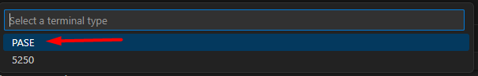
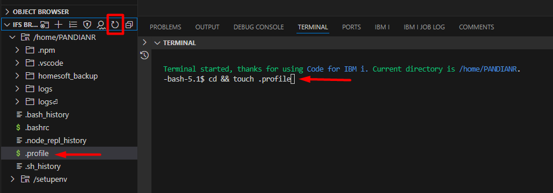
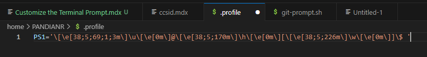
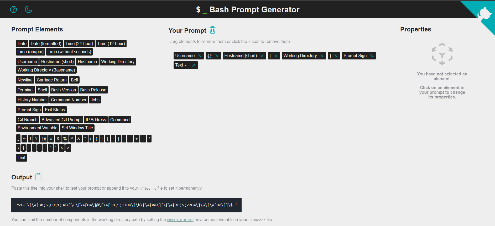

import { Icon } from '@astrojs/starlight/components';

It is possible to change the PASE terminal prompt to your liking. You may follow simple/advance method based on your requirement. 


* Following the [Simple method](#simple-method) would help the users to know the currently logged user, server name, current working directory etc., without the need to issue a `whoami`, `pwd` or  command. This would be particularly helpul if you work with multiple IBMi servers. 
* Doing [Advanced changes](#advanced-method) like modifying the `PROMPT_COMMAND` variable can display advanced git statuses of the currently working git directory. This would be particularly useful if you're working with multiple Git Repositories in your IBM i. 

## Simple Method:
If you don't work with Git repositories stored on your IFS, then we would suggest you to choose this method as this is much faster. All that we need to do is to change the `PS1` prompt variable inside the `.profile` file. 


### Steps
1. Bash should be your default shell. If it is not, or you're unsure then you need to [set bash as your default shell.](/docs/tips/bash/)
2. After getting connected to the IBMi server, Open the terminal by entering `Ctrl+Shift+J` and select `PASE`.
    
3. If not present already, create a `.profile` file in your home directory by running the command below.
    ```sh
    cd && touch .profile
    ```
    
4. Open the `.profile` file in your VS Code Editor and paste the content below. Don't worry if you already have the `.profile` file present with some content in it. Just place this content in the last line. 

    ```sh
    PS1='\[\e[38;5;69;1;3m\]\u\[\e[0m\]@\[\e[38;5;170m\]\h\[\e[0m\][\[\e[38;5;226m\]\w\[\e[0m\]]\$ '
    ```
    

    Save the `.profile` file.

5. Close the current terminal and reopen again by entering `Ctrl+Shift+J` and select `PASE`.


### How to customize your prompt?
There is a dedicated website where you can cherry pick and choose the things that you'd like to display on the terminal. You can even change the colors and formatting of the text by using the properties section. Check out this awesome [bash prompt generator](https://bash-prompt-generator.org/) to customize it according to your liking. 




## Advanced Method:
By modifiying the `PROMPT_COMMAND`, we can display the git status on the prompt string. 

When I was learning Git, I modified the powershell terminal to reflect the git status of my current working git directory. There was an application called [posh git](https://github.com/dahlbyk/posh-git)  which would show us the git status on the prompt itself like below. I was trying to replicate the same in PASE. Then I came to know about the `__posh_git_ps1` shell function which can output the Git Status in an easily understandable string format. 


This means, I am currently on the folder called `gitrepo` which is a git repository.
The cyan master = Branch name
? = No remote repository configured
The green +1 = One file is tracked and it is newly added 
The red +2 = Two files are added and untracked


### Step-1: 
First, get the `git-prompt.sh` shell script that can evaluate the git status. You can read more about this script [here](https://github.com/lyze/posh-git-sh).
```sh
/QOpenSys/pkgs/bin/wget --show-progress https://raw.githubusercontent.com/lyze/posh-git-sh/refs/heads/master/git-prompt.sh -O .git-prompt.sh
```


### Step-2:
Setup the open source path variable in `.profile` file. This is required or the `git-prompt.sh` to work correctly.
```sh
echo "export PATH=/QOpenSys/pkgs/bin:$PATH" >> .profile
```


### Step-3:
Setup the `PROMPT_COMMAND` to reflect the git status. Run the three commands one by one.  Know that the `PROMPT_COMMAND` is a special shell variable that gets executed each time before the shell's primary prompt (PS1) is displayed. 
```sh
echo "PROMPT_COMMAND='__posh_git_ps1 \"\${VIRTUAL_ENV:+(\`basename \$VIRTUAL_ENV\`)}\\[\\e[32m\\]\\u\\[\\e[0m\\]@\\h:\\[\\e[33m\\]\\w\\[\\e[0m\\] \" \"\\\\\\\$ \";'\$PROMPT_COMMAND" >> .profile
echo "source ~/.git-prompt.sh" >> .profile
source ~/.profile
```

### How it works?
We are instructing the `PROMPT_COMMAND` to call the `git-prompt.sh`  script everytime the prompt is displayed. 

The function `__posh_git_ps1` takes two parameters (`__posh_git_ps1 <prefix> <suffix>`), and sets `PS1` to `<prefix><status><suffix>`.
